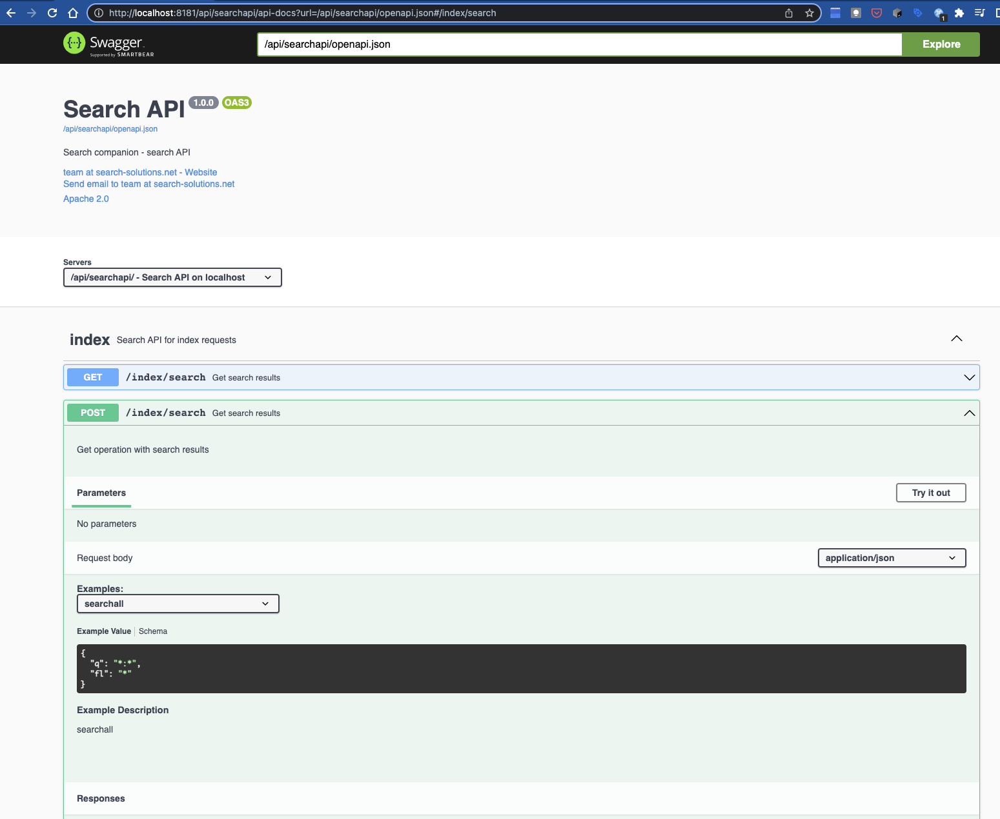

# companion-demo

### Prerequisite for running the demo
This demo relies on docker compose [https://docs.docker.com/compose/](https://docs.docker.com/compose/). So a recent version of docker compose should be available in order to run this demo.

### Run the demo
- clone this project in your working directory
```
git clone https://github.com/search-companion/companion-demo.git
```
- start up the companion_demo network
```
cd ./companion-demo
docker compose up
```

This starts up 4 containers and you should see the log output of the 4 containers:
 - companion_zoo: 1 zookeeper host (zoo1)
 - companion_solr: 1 solr server (solr1) with solr admin on [http://localhost:8983/](http://localhost:8983/)
 - companion_db: 1 db server (db1)
 - companion_karaf: 1 companion karaf server (karaf1) with admin on [http://localhost:8181/hawtio/](http://localhost:8181/hawtio/) (with username=karaf and password=karaf)

In order to stop the companion_demo network, press ^C in the terminal.

To clean up the companion_demo network, run the following command in the folder where the containers were started:
```
docker compose down
```

#### Dataimport
The companion dataimport routine imports the data from the source db (database companion on db1) into the target solr collection (collection gettingstarted on solr1) and keeps it in sync when source db is being updated.

There are 2 types of imports: 
- **full import**: copies all source records to the target solr collection, optionally with alias handling (new collection and alias assignment)
- **delta import**: copies only the changed records to the target solr collection

The full import process requires to be started manually (by starting the "data-import-full" camel route). 
The full import will create a new collection ("gettingstarted" concatenated with the timestamp), read all records from the source db and push those to the target solr collection. After the final commit, an alias "gettingstarted"
will be generated that points to the new collection in order to make it available for searching via "gettingstarted".

The **field mapping** is configurable via the config file. Simple mappings can be done via configuration where solr fields are linked to incoming data. As an example, please review the config file of the demo that  is available [here](https://github.com/search-companion/companion/blob/main/companion-dataimport-example/src/main/resources/etc/companion.dataimport.example.cfg). 
For more advanced mapping logic, a java class can be provided as mapper either via adding the mapper class to the context (`<bean id="solrMapper" class="path.to.your.SolrMapper"/>`) 
or by adding the fully qualified class name in the config file: `solr.mapper.class=path.to.your.SolrMapper`.

In the demo configuration, the delta import process will run periodically (every 20s): when 1 or more records are added to the source db, this delta import will pick up the record(s), perform some mapping towards the solr document and push the solr documents to the target solr collection.

An additional camel route is set in this demo config that adds every minute a new record in the source db. This way, the delta import functionality can be followed as records are changed in the source db.

The processes can be followed up via the log of the karaf container.
This log (and the camel routes) can be accessed via:
1) the hawtio admin console on our karaf container available on [http://localhost:8181/hawtio/](http://localhost:8181/hawtio/) after login (with username=karaf and password=karaf) and selecting the "Logs" tab.
This hawtio console also allows you to inspect the details and metrics of the different camel routes via the "Camel" tab.


2) the karaf CLI client for the companion_karaf container (with username=karaf and password=karaf):
```
ssh karaf@localhost -p 8101
```
At the prompt of the karaf client, look at the log via the "log:tail" or the "log:display" (or using the "ld" alias) command:
```
karaf@root() > log:tail
```
To view the camel routes, use the following command in the CLI:
```
karaf@root()> camel:route-list
```
At this karaf CLI, the source db and the target solr collection can be queried via jdbc within karaf:
```
karaf@root() > ds-list
karaf@root()> query db-ds "select * from items"
karaf@root()> query solr-ds "select id,date_dt,status_s from gettingstarted where id like 'item_id_*'"
```

#### The search API
The search api is available on [http://localhost:8181/api/](http://localhost:8181/api/). 

For the swagger UI use [http://localhost:8181/api/searchapi/api-docs?url=/api/searchapi/openapi.json](http://localhost:8181/api/searchapi/api-docs?url=/api/searchapi/openapi.json).


There is a CLI client available to perform the request from within the karaf CLI. Use the following command for help on the available options:
```
karaf@root()> searchapi:search --help
```
E.g.:
```
karaf@root()> search *:*
{
  "solr.response" : {
    "responseHeader" : {
      "zkConnected" : true,
      "status" : 0,
      "QTime" : 4,
      "params" : {
        "q" : "*:*",
        "fl" : "id",
        "wt" : "javabin",
        "version" : "2"
      }
    },
    "response" : [ {
      "id" : "item_id_19990101_084702"
    }, {
      "id" : "item_id_19990101_084802"
    }, {
      "id" : "item_id_19990101_084902"
    }, {
      "id" : "item_id_19990101_085002"
    }, {
      "id" : "item_id_19990101_085102"
    }, {
      "id" : "item_id_19990101_085202"
    }, {
      "id" : "item_id_19990101_085302"
    }, {
      "id" : "item_id_19990101_085402"
    }, {
      "id" : "item_id_19990101_085502"
    }, {
      "id" : "item_id"
    } ]
  }
}
```

### Feedback
It should be clear by now that this implementation shows only a limited introduction of the capabilities of this integration framework. I hope this demo inspires you to take a deeper dive.

We welcome feedback and contributions! Contact us at [info@search-companion.org](mailto:info@search-companion.org).

